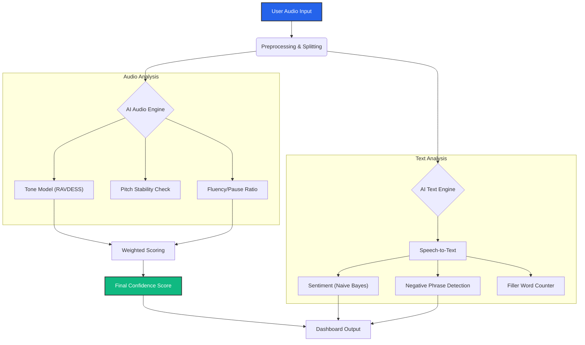

# Confidence Engine

**Confidence Engine** is an advanced AI-powered tool designed to analyze sales pitches, presentations, and speeches. It combines **Audio Signal Processing** (Tone, Pitch, Fluency) with **Natural Language Processing** (Sentiment, Key Phrases) to provide a holistic "Confidence Score" and "Sales Score".

It helps users understand *how* they speak (delivery) and *what* they say (content), offering actionable feedback to improve communication skills.

> **⚠️ Note on Accuracy**: This project is currently in active development. The AI models are approximately **60% accurate** at this stage. We are continuously improving the dataset and training logic to enhance precision.

## 🏗️ System Overview

``

### How It Works (Logic Flow)


---

## 🚀 Key Features

### 1. Multi-Modal Analysis
-   **Audio Analysis**: Uses a Deep Learning model (trained on RAVDESS) to detect confident vs. fearful tones.
-   **Content Analysis**: Uses a custom-trained Naive Bayes classifier (Bigram-aware) to detect positive/negative sales sentiment.

### 2. Advanced Metrics
-   **Pitch Stability**: Detects shaky or nervous voices using pitch variance analysis ($f0$ Standard Deviation).
-   **Fluency Score**: Calculates a "Flow" score based on pause ratios and silence gaps (100% = No unnatural pauses).
-   **Filler Word Detection**: Automatically counts distractor words like "um", "uh", "sort of", "actually".

### 3. Smart Visualization
-   **Transcript Highlighting**: Uses "Phrase-First Priority" logic to intelligently color-code text.
    -   *Red*: Negative words ("Loss", "Problem") or phrases ("High Risk").
    -   *Green*: Positive words ("Growth", "Success").
    -   *Neutral*: Context-aware handling (e.g., "High" in "High Risk" is not colored green).
-   **Dynamic Scoring**: The Final Confidence Score is a weighted mix of **Tone (60%)** and **Fluency (40%)**, ensuring a natural evaluation that doesn't just rely on text keywords.

---

## 📸 Functionality Overview

### The Dashboard
Interface allows you to record audio directly or analyze existing files.
_(Add a screenshot of the main dashboard here)_
``

### Real-time Transcription & Highlighting
See your speech transcribed with real-time feedback on your word choice.
_(Add a screenshot of the transcript section here)_
``

### Detailed Scoring Breakdown
Understand exactly why you got your score with a granular breakdown of every metric.
_(Add a screenshot of the "Detailed Scoring Logic" expander here)_
``

---

## 🛠️ Step-by-Step Setup Guide

Follow these instructions to set up the project on your local machine (Mac/Linux/Windows).

### Prerequisites
-   **Python 3.9+** installed.
-   **Git** installed.
-   **FFmpeg** (Required for audio processing).
    -   *Mac*: `brew install ffmpeg`
    -   *Windows*: Download and add to PATH.

### Installation

1.  **Clone the Repository**
    ```bash
    git clone https://github.com/nahinfardeen-ux/Confidence-engine.git
    cd Confidence-engine
    ```

2.  **Create a Virtual Environment**
    It is recommended to use a virtual environment to avoid conflicts.
    ```bash
    # Mac/Linux
    python3 -m venv venv
    source venv/bin/activate

    # Windows
    python -m venv venv
    .\venv\Scripts\activate
    ```

3.  **Install Dependencies**
    ```bash
    pip install -r requirements.txt
    ```
    *Note: If you encounter issues installing `pyaudio`, ensure you have `portaudio` installed (`brew install portaudio` on Mac).*

4.  **Run the Application**
    You can start the app using the provided shell script or directly via Streamlit.
    ```bash
    # Option A: Using the script (Mac/Linux)
    chmod +x run.sh
    ./run.sh

    # Option B: Direct Streamlit command
    streamlit run src/app.py
    ```

5.  **Access the App**
    Open your browser and go to:
    `http://localhost:8501`

---

## 🧠 Model Training (Optional)

The project comes with pre-trained models in the `models/` directory. If you want to retrain them with your own data:

### Train Audio Model (Tone)
1.  Place your dataset (RAVDESS or similar) in `data/raw/audio/`.
2.  Run the training script:
    ```bash
    python src/train_audio.py
    ```
    *This will save `audio_model.h5` to the `models/` folder.*

### Train Text Model (Sentiment)
1.  Ensure you have your text dataset (e.g., `FinancialPhraseBank`).
2.  Run the training script:
    ```bash
    python src/train_text.py
    ```
    *This will save `text_model.pkl` and `vectorizer.pkl`.*

### Custom Word Lists
You can customize the "Good" and "Bad" words by editing:
-   `models/positive_words.json`
-   `models/negative_words.json`

---
